# TextminR - API & Data Store Quickstart

## Data Store

Als Data Store für TextminR wird ein Elasticsearch Image auf DigitalOcean verwendet. Wenn ihr auf die Projektseite geht, könnt ihr zwei Komponenten sehen:

- jellyfish-app: Die API, die den Zugriff auf die Datenbank ermöglicht (könnt ihr gerne umbenennen :D ).
- texminr-es: Die Elasticsearch Instanz (Data Store), wo alle wichtigen Daten (Texte, Autoren, Zeitungsartikel) gespeichert sind.

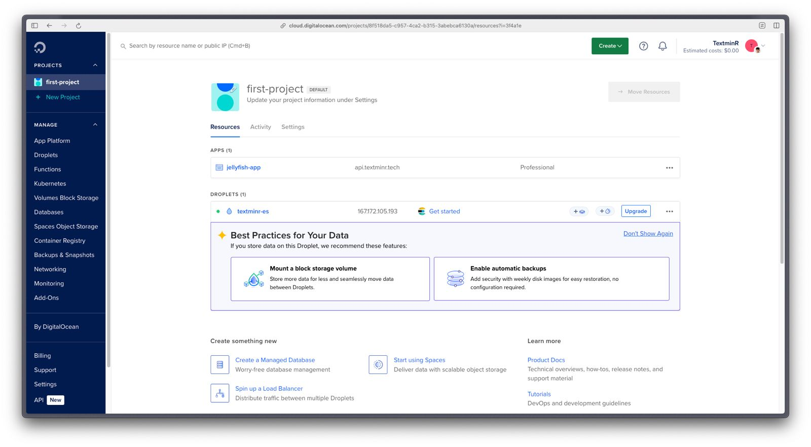

Ihr werdet sehr wahrscheinlich etwas an der API ändern wollen. Die DigitalOcean Instanz basiert auf meinem Docker-Hub Repository. Falls Ihr möchtet, füge ich euch gerne als Collaborator in das Repository hinzu (Dafür bräuchte ich euren Docker-Username). Alternativ könnt ihr ein eigenes Docker-Hub Repository erstellen, wo ihr dann eure APIs published. Jedenfalls, um die DigitalOcean Instanz zu aktualisieren mit dem `latest` Docker Image, müsst ihr auf `Actions` > `Force Rebuild and Deploy` klicken. Falls ihr einen eigenen Server bekommt, wo ihr alles hosten könnt, könnt ihr dies natürlich auch tun. Ich kann euch aber nur das Erstellen von eigenen Docker Images ans Herz legen, da dies die Arbeit wesentlich vereinfacht.

Um Umgebungsvariablen für Sachen wie die Daten für die Verbindung zum Elasticsearch Data Store zu ändern/hinzuzufügen, bitte auf die Settings-Page gehen.

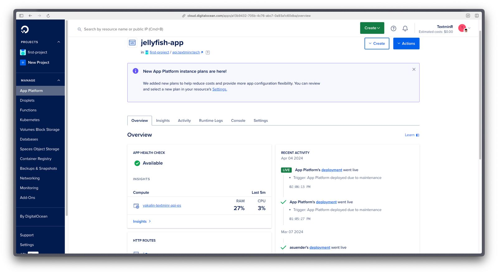

Bei der Elasticsearch Instanz gibt es nicht viel zu sagen, das einzige wirklich wichtige ist die IP-Adresse, die links oben steht (167.172.105.193).

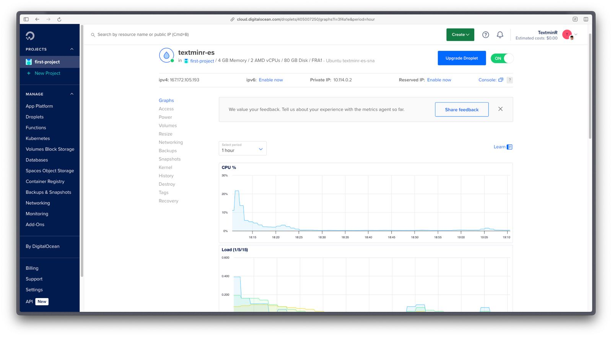

Mit Elasticsearch interagieren kann man über die verschiedenen APIs (https://www.elastic.co/guide/en/elasticsearch/reference/current/rest-apis.html). Ich bevorzuge es aber, wenn man eine Art Dashboard hat, wo man eine bessere Übersicht über alles hat. Dafür verwende ich einen Kibana Container, den ich lokal laufen lasse.

## Kibana

Kibana kann man mit folgendem Befehl lokal starten `docker run --name textminr_kib2 -p 5601:5601 -e ELASTICSEARCH_SSL_VERIFICATIONMODE=certificate -d docker.elastic.co/kibana/kibana:8.12.1`. Es gibt aktuellere Versionen als 8.12.1, aber da ich über das ganze Projekt hinüber diese Version verwendet habe, werde ich mich hier auch nur darauf beziehen. Ihr könnt gerne eine neuere Version verwenden. Außerdem ist es wichtig, die Umgebungsvariable "elasticsearch.ssl.verificationMode" auf "certificate" zu setzen. Da sich die IP-Adresse unserer Elasticsearch-Instanz geändert hat, ist die IP-Adresse im SSL-Zertifikat veraltet. Mit dem verificationMode "certificate" kann man die Überprüfung des Hostname überspringen. Ansonsten ist eine Verbindung nicht möglich. (Ihr könnt gerne wenn ihr die Zeit findet das SSL-Zertifikat von der Elasticsearch Instanz neu generieren mit der neuen IP-Adresse, ist aber nicht unbedingt notwendig. Das einzige was verloren geht ist ein bisschen Sicherheit.)

Schaut man jetzt auf `localhost:5601`, sieht man folgende Seite:

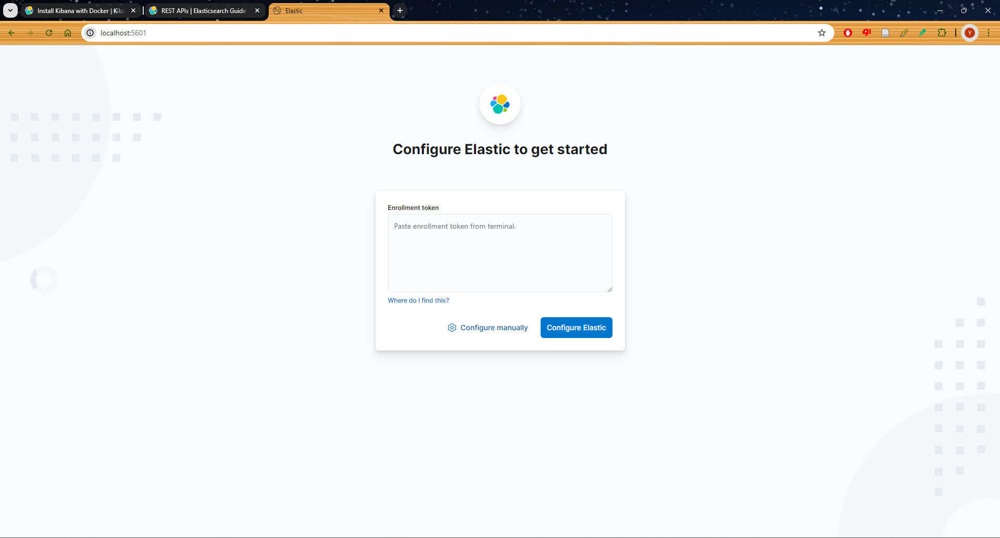

Da DigitalOcean irgendwie ein komisches Elasticsearch Image verwendet, haben wir keinen Kibana enrollment Token mehr und können auch keinen generieren, deswegen auf  `Configure manually` drücken.

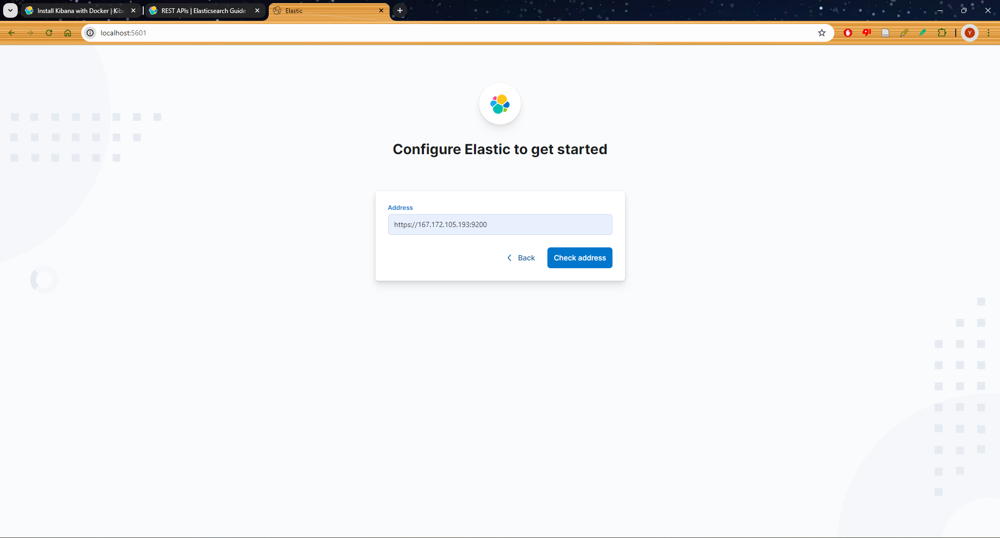

Diese Adresse eingeben und auf `Check address` drücken. Die hier eingegebene Adresse ist die public IP-Adresse des Elasticsearch images auf DigitalOcean. Falls ihr das Networking umstellt bzw. euch mit einem anderen Elastichsearch verbinden wollt, die Adresse dementsprechend ändern.

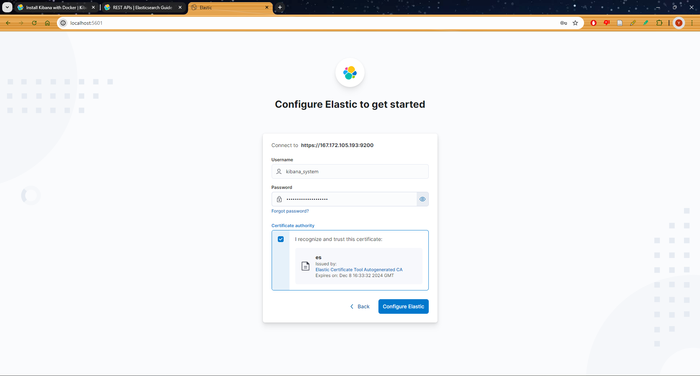

Hier dann die Credentials für den Kibana-User eingeben und das Zertifikat akzeptieren. Die Credentials teilen wir euch privat mit.

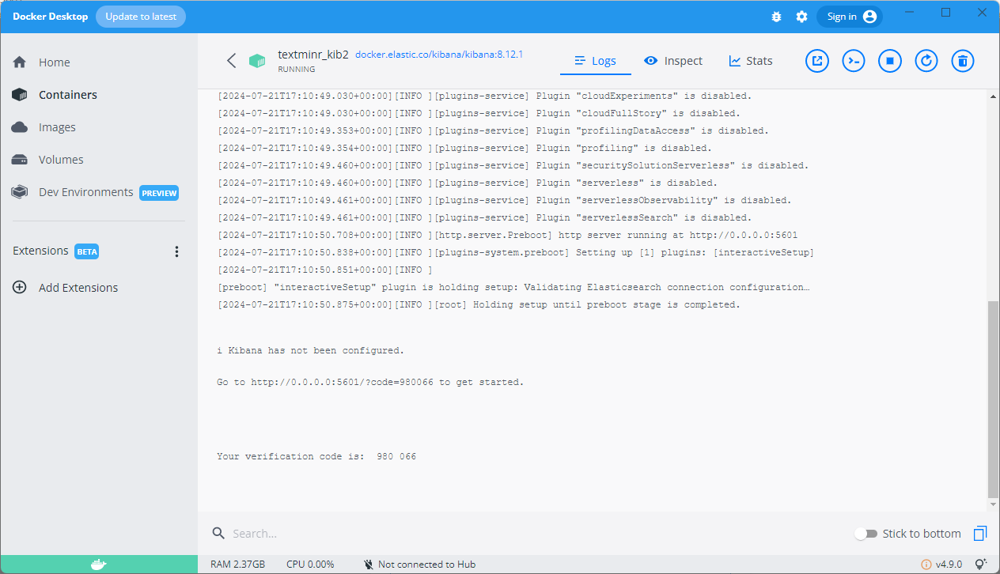

Im nächsten Schritt wird ein Verification Code verlangt. Diesen findet man in den Logs des Containers.

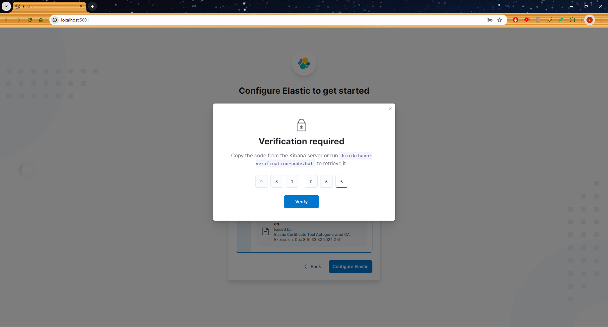

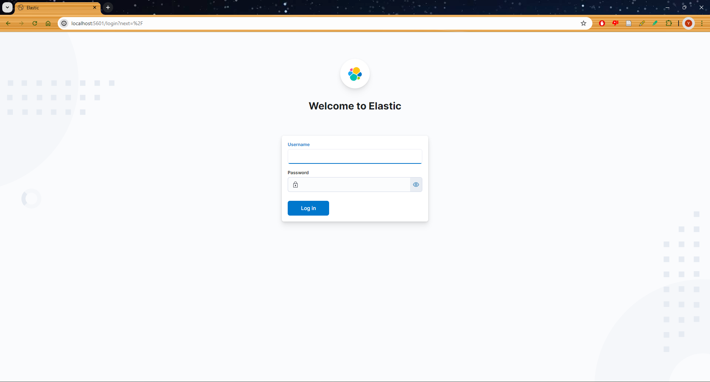

Hat alles geklappt, kommt man schlussendlich auf eine Anmeldeseite, wo man sich mit dem Elasticsearch-User anmelden muss. Hier geben wir euch die Daten auch privat mit.

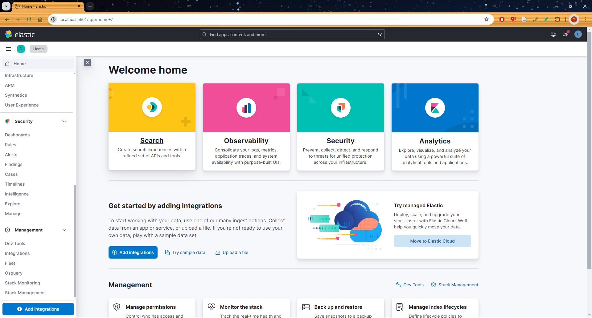

Das Wichtigste beim Dashboard sind die Dev Tools, die findet man ganz unten in der linken Menüleiste.

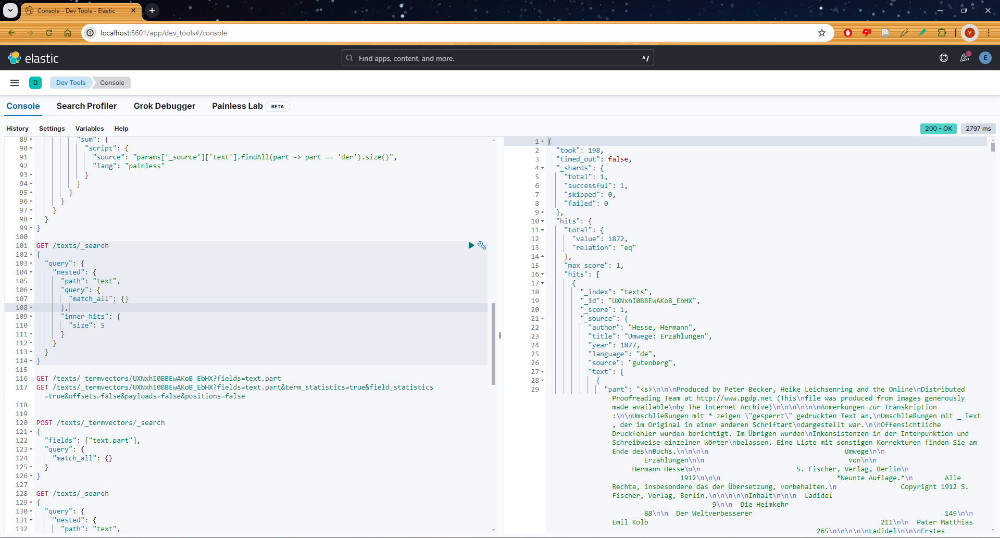

In den Dev Tools kann man vor allem API-Requests an die Elasticsearch Datenbank machen. Diese bleiben auch gespeichert, solange man den Cache/Cookies nicht löscht.

##  API

Unsere API kann man unter `api.textminr.tech` erreichen. Unter `/docs` befindet sich die API-Dokumentation.

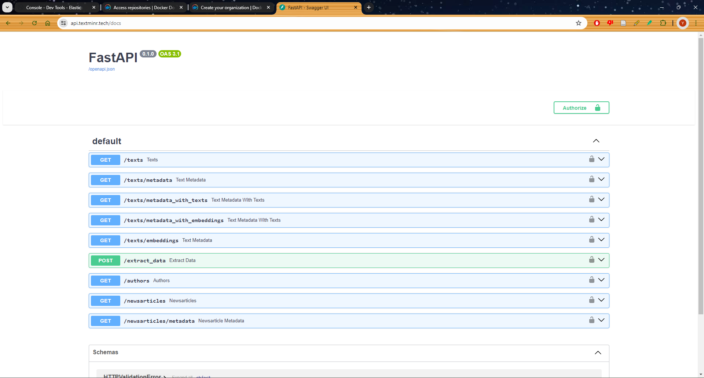

Wir haben die API mit einem API-Key gesichert. Bei jeder Abfrage muss dieser mitgegeben werden. Diesen teilen wir euch ebenfalls privat mit. Grundsätzlich haben wir nur GET-Endpoints, bis auf den `/extract_data` Endpoint, welcher einen Text nimmt und Autor und Jahr daraus extrahiert. Alle `/texts` Endpoints greifen auf literarische Daten (Romane, Erzählungen, ...) zu. Der `/authors` Endpoint greift auf Daten von Autoren zu und die `/newsarticles` Endpoints greifen auf Zeitungsartikel zu. Da wir sehr viele Daten haben, ist es ratsam, auf der `/docs` Seite keine großen Abfragen durchzuführen, da der Browser mit der großen Datenmenge schlichtweg nicht mithalten kann. Deswegen im Browser sehr begrenzte Abfragen durchführen (z.B. minYear=1830 & maxYear=1831). 